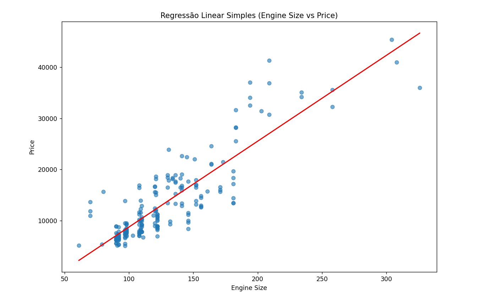

# Projeto de Regressão Linear, Ridge e Lasso

Este projeto tem como objetivo aplicar técnicas de **regressão linear** para prever o preço de veículos, seguindo uma sequência estruturada de pré-processamento, modelagem, avaliação e interpretação dos resultados. O trabalho foi desenvolvido com base no dataset Car Price Prediction, disponibilizado no Kaggle. O foco do projeto não é uma análise exploratória aprofundada, mas sim compreender o dataset, preparar os dados corretamente,
aplicar um modelo de regressão linear, avaliar seu desempenho, e visualizar a relação entre a variável mais correlacionada e o preço.

---

## 📁 Estrutura do Projeto

```
├── preprocessamento.py            # Pré-processamento e correlação
├── regressao_linear_simples.py    # Regressão linear simples
├── linear_ridge_lasso.py          # Linear vs Ridge vs Lasso
├── coeficientes.py                # Coeficientes e seleção de atributos
├── CarPrice_dataset_ajustado.csv  # Dataset ajustado
├── imagem                         # Imagens de resultados
└── README.md
```

---
## 📂 Dataset

Fonte: Kaggle

Link: https://www.kaggle.com/datasets/hellbuoy/car-price-prediction

Nome do arquivo original: CarPrice_Assignment.csv

O dataset contém informações de diferentes automóveis, incluindo características como:

* tipo de combustível

* tamanho do motor

* potência

* consumo

* dimensões do veículo

* preço (variável alvo)

---

## Bibliotecas utilizadas

Este projeto foi desenvolvido em Python utilizando bibliotecas amplamente empregadas em análise de dados e aprendizado de máquina, conforme descrito abaixo:

---

Pandas: Biblioteca utilizada para carregamento, manipulação e análise de dados tabulares.
Permite ler arquivos CSV, tratar colunas, selecionar variáveis e realizar análises estatísticas básicas.
```python
import pandas as pd
```
Matplotlib: Biblioteca fundamental para criação de gráficos em Python.
Foi utilizada para plotar gráficos de dispersão, retas de regressão e gráficos de importância dos atributos.
```python
import seaborn as pd
```
Seaborn: Biblioteca de visualização estatística baseada no matplotlib.
Facilita a criação de gráficos mais elegantes, como mapas de correlação, boxplots e distribuições.
```python
import matplotlib.pyplot as plt
```
NumPy: Biblioteca fundamental para operações numéricas e matemáticas em Python.
Foi utilizada para cálculos como o RMSE, manipulação de arrays e operações vetoriais.
```python
import numpy as np
```
train_test_split: Função do scikit-learn utilizada para dividir o dataset em conjuntos de treino e teste, garantindo uma avaliação adequada do modelo.
```python
from sklearn.model_selection import train_test_split
```
StandardScaler: Utilizada para padronização dos dados numéricos, fazendo com que todas as variáveis tenham média 0 e desvio padrão 1.
Essa etapa é essencial para modelos sensíveis à escala, como Ridge e Lasso.
```python
from sklearn.preprocessing import StandardScaler
```
LinearRegression: Modelo de Regressão Linear do scikit-learn.
Foi aplicado tanto na regressão linear simples quanto na regressão linear múltipla.
```python
from sklearn.linear_model import LinearRegression
```
Ridge Regression: Modelo de regressão linear com regularização L2, utilizado para reduzir overfitting e controlar a magnitude dos coeficientes.
```python
from sklearn.linear_model import Ridge
```
Lasso Regression: Modelo de regressão linear com regularização L1, capaz de zerar coeficientes, sendo útil para seleção de atributos e análise de importância das variáveis.
```python
from sklearn.linear_model import Lasso
```
cross_val_score: Função utilizada para aplicar validação cruzada (cross-validation), permitindo avaliar o desempenho dos modelos de forma mais robusta.
```python
from sklearn.model_selection import cross_val_score
```
Métricas de Avaliação: Foram utilizadas métricas para avaliar o desempenho dos modelos de regressão:
RMSE (Root Mean Squared Error): mede o erro médio das previsões.
R² (Coeficiente de Determinação): indica o quanto o modelo explica a variabilidade da variável alvo.
```python
from sklearn.metrics import mean_squared_error, r2_score
```

---

## Pré-processamento e Correlação

**Arquivo:** `preprocessamento.py`

Nesta etapa inicial, foi realizado o preparo dos dados para a modelagem:

1. O dataset original foi carregado.

Inicialmente, o dataset bruto foi carregado utilizando a biblioteca Pandas, e foram realizadas inspeções básicas para compreender sua estrutura:
* Visualização das primeiras linhas do dataset (head)
* Verificação dos tipos de dados de cada coluna
* Verificação de valores ausentes (missing values)
Essa etapa permitiu confirmar que o dataset não possui valores nulos, eliminando a necessidade de técnicas de imputação.

2. Tratamento de variáveis categóricas.

O dataset contém diversas variáveis categóricas, como tipo de combustível, carroceria, tipo de motor e sistema de combustível. Como modelos de regressão não trabalham diretamente com dados categóricos em formato textual, foi necessário convertê-los para valores numéricos.
As seguintes colunas categóricas foram identificadas:
* CarName
* fueltype
* aspiration
* doornumber
* carbody
* drivewheel
* enginelocation
* enginetype
* cylindernumber
* fuelsystem
  
Para isso, foi utilizado o método `pd.factorize()`, que transforma cada categoria em um valor inteiro único. Esse método foi escolhido por ser simples e suficiente para esta etapa exploratória e de modelagem inicial.
Após a conversão, todas as colunas do dataset passaram a possuir valores numéricos.

3. Análise de Correlação e matriz de correlação entre as variáveis numéricas e a variável-alvo (`price`).

Com os dados totalmente numéricos, foi realizada uma análise de correlação entre todas as variáveis e a variável alvo price.
Essa análise teve como objetivo:
Identificar quais atributos possuem maior relação com o preço dos veículos e auxiliar na seleção das variáveis mais relevantes para os modelos de regressão.
As correlações foram ordenadas de forma decrescente, permitindo identificar rapidamente as variáveis mais correlacionadas positiva ou negativamente com o preço.

```
Correlação das variáveis com Price:
 price               1.000000
enginesize          0.874145
curbweight          0.835305
horsepower          0.808139
carwidth            0.759325
carlength           0.682920
...                   ...
fuelsystem         -0.122118
drivewheel         -0.577992
citympg            -0.685751
highwaympg         -0.697599
```
Além da correlação individual com a variável alvo, foi construída uma matriz de correlação completa, considerando todas as colunas numéricas do dataset.
Foi utilizado o método de correlação Spearman, por ser mais robusto a relações não lineares e valores extremos.


4. O dataset final pré-processado foi salvo no arquivo `regressao_ajustado.csv`.

Essa etapa é fundamental para garantir qualidade dos dados e evitar vieses nos modelos.

---

## Regressão Linear Simples

**Arquivo:** `regressao_linear_simples.py`

Nesta etapa, foi aplicada a regressão linear simples com o objetivo de entender a relação entre uma variável explicativa e o preço.
Após a etapa de pré-processamento e análise de correlação, foi aplicada uma Regressão Linear Simples com o objetivo de modelar a relação entre o preço dos veículos (`price`) e a variável `enginesize`, identificada como a mais correlacionada com a variável alvo.

1. A variável mais correlacionada com o preço foi escolhida para o modelo.
A variável `enginesize` foi selecionada como única variável explicativa do modelo, enquanto `price` foi definida como variável alvo. A escolha dessa feature foi baseada na análise prévia de correlação, que indicou uma forte relação positiva entre essas duas variáveis.

2. Uso do LinearRegression
O modelo de Regressão Linear Simples foi treinado utilizando o algoritmo LinearRegression da biblioteca scikit-learn. Inicialmente, o modelo foi ajustado utilizando todo o conjunto de dados com a finalidade de visualizar a relação linear entre as variáveis por meio de um gráfico.

4. Um gráfico foi gerado exibindo os pontos reais e a reta de regressão ajustada.

.

Foi gerado um gráfico de dispersão contendo os valores reais do dataset, juntamente com a reta de regressão estimada pelo modelo. Essa visualização permite observar claramente a tendência de crescimento do preço conforme o tamanho do motor aumenta, confirmando o comportamento identificado na análise de correlação.

5. O desempenho do modelo foi avaliado utilizando as métricas **RMSE** e **R²**.

Para avaliar o desempenho do modelo de forma adequada, o dataset foi dividido em conjuntos de treinamento (80%) e teste (20%). Essa separação garante que a avaliação seja realizada em dados não utilizados durante o treinamento do modelo. Após o treinamento, o modelo foi aplicado ao conjunto de teste, e seu desempenho foi avaliado utilizando duas métricas amplamente empregadas em problemas de regressão:
* RMSE (Root Mean Squared Error), que mede o erro médio das previsões do modelo.
O RMSE foi 3932.61. Considerando que o preço médio dos veículos no dataset está em torno de 13.000, esse erro pode ser considerado moderado, sendo esperado para um modelo simples que utiliza apenas uma única variável explicativa.

* R² (Coeficiente de Determinação), que indica a proporção da variabilidade do preço explicada pela regressão linear simples.
O valor de R² = 0.8041 indica que aproximadamente 80% da variação do preço dos veículos pode ser explicada apenas pelo tamanho do motor. Esse resultado evidencia uma forte relação linear entre enginesize e price, confirmando a relevância dessa variável como principal fator explicativo do preço no dataset.

Essa análise fornece uma visualização clara da relação linear entre a variável escolhida e o preço.

---

## Comparação: Linear vs Ridge vs Lasso

**Arquivo:** `linear_ridge_lasso.py`

Após a aplicação da regressão linear simples, foram avaliados modelos de regressão mais robustos com o objetivo de comparar o desempenho da regressão linear tradicional com métodos que utilizam regularização, especificamente Ridge e Lasso.

Essa etapa teve como foco analisar se a inclusão de regularização poderia melhorar a capacidade de generalização do modelo e reduzir possíveis problemas de overfitting.

1. Preparação dos Dados

O dataset utilizado foi o CarPrice_dataset_ajustado.csv, previamente pré-processado. Para manter a comparação justa entre os modelos, foi utilizada apenas a variável enginesize, mantendo o mesmo cenário da regressão linear simples.

2. Uso de Pipeline e Padronização

Cada modelo foi implementado utilizando um Pipeline, que integra duas etapas principais:
* Padronização dos dados por meio do StandardScaler, garantindo que a variável explicativa possua média zero e desvio padrão igual a um.
* Treinamento do modelo de regressão, seja Linear, Ridge ou Lasso.
  
O uso de pipelines assegura que o processo de padronização seja corretamente aplicado em cada iteração da validação cruzada, evitando vazamento de dados (data leakage).

3. AValidação Cruzada (Cross-Validation)

Para avaliar o desempenho dos modelos de forma mais robusta, foi aplicada validação cruzada com 5 folds. Nesse processo, o dataset é dividido em cinco partes, e cada modelo é treinado e avaliado cinco vezes, utilizando diferentes subconjuntos de dados para treino e teste.

Foram utilizadas duas métricas de avaliação:
* RMSE Médio, calculado a partir do erro quadrático médio negativo retornado pelo cross_val_score.
* R² Médio, que mede o poder explicativo médio do modelo ao longo dos folds.

Essa abordagem reduz a dependência de uma única divisão treino-teste e fornece uma estimativa mais confiável do desempenho dos modelos.

4. Os resultados foram organizados em uma tabela comparativa.

A ordenação dos modelos pelo menor RMSE médio permite identificar qual abordagem apresentou melhor desempenho em termos de erro de previsão.
```
Tabela Comparativa dos Modelos:

              Modelo   RMSE Médio  R² Médio
1   Ridge Regression  4077.913440  0.558653
2   Lasso Regression  4081.260581  0.557126
0  Linear Regression  4081.271170  0.557122
```

5. O melhor modelo foi identificado com base no menor RMSE.

A comparação entre os modelos de Regressão Linear, Ridge e Lasso, realizada por meio de validação cruzada com 5 folds, mostrou que o Ridge Regression apresentou o melhor desempenho, obtendo o menor valor de RMSE médio e o maior R² médio.

No entanto, a diferença entre os modelos foi relativamente pequena, indicando que todos apresentaram comportamentos semelhantes ao modelar a relação entre enginesize e price. Esse resultado sugere que, ao utilizar apenas uma única variável explicativa, o impacto da regularização é limitado.

Ainda assim, o Ridge Regression demonstrou maior estabilidade e capacidade de generalização, o que justifica sua escolha como o melhor modelo entre os avaliados. Esses resultados reforçam a importância da regularização, mesmo quando os ganhos de desempenho são sutis.

---

## Questão 4 – Coeficientes e Seleção de Atributos

**Arquivo:** `regressao_q4.py`

Na etapa final do projeto, foi utilizada a Regressão Lasso com o objetivo de analisar a importância das variáveis explicativas e identificar quais atributos possuem maior influência na previsão do preço dos veículos.

Diferentemente da regressão linear tradicional, o Lasso aplica regularização L1, que tende a reduzir coeficientes menos relevantes, podendo inclusive zerá-los, tornando-se uma ferramenta eficaz para seleção de atributos.

1. Seleção das variáveis mais revelantes.

Para esta análise, foram selecionadas três variáveis explicativas:
* enginesize
* carheight
* horsepower

Essas variáveis foram escolhidas com base na análise de correlação e em sua relevância técnica para a formação do preço dos veículos.


2. Padronização dos Dados.

Antes do treinamento do modelo Lasso, os dados foram padronizados utilizando o StandardScaler. Essa etapa é fundamental, pois a regressão Lasso é sensível à escala das variáveis. A padronização garante que todas as variáveis tenham média zero e desvio padrão igual a um, permitindo uma comparação justa entre os coeficientes.

3. Treinamento do Modelo Lasso.

O modelo Lasso foi treinado utilizando o parâmetro de regularização α = 0.1, valor que equilibra a penalização dos coeficientes sem eliminar completamente variáveis relevantes.

Após o treinamento, os coeficientes associados a cada atributo foram extraídos para análise.

4.Análise dos Coeficientes 

Os coeficientes obtidos pelo modelo Lasso foram organizados em um DataFrame, juntamente com seus valores absolutos, permitindo avaliar a importância relativa de cada variável.

.

O atributo enginesize apresentou o maior coeficiente absoluto, indicando que o tamanho do motor é o fator mais influente entre os avaliados para a determinação do preço dos veículos. Esse resultado é consistente com as análises anteriores de correlação e regressão linear simples, reforçando a importância dessa variável.

Em segundo lugar, horsepower também apresentou uma contribuição significativa, mostrando que a potência do motor exerce um impacto relevante no preço, embora inferior ao tamanho do motor.

A variável carheight, apesar de apresentar influência positiva, teve uma importância consideravelmente menor quando comparada às demais, indicando que seu efeito sobre o preço é mais limitado dentro do conjunto de variáveis analisadas.

---

## Conclusão 

Neste projeto, foi realizada a análise do dataset Car Price Prediction com o objetivo de prever o preço de veículos a partir de suas características. Após o tratamento dos dados, foram aplicados modelos de Regressão Linear Simples, Linear Múltipla, Ridge e Lasso.

Os resultados mostraram que a variável enginesize possui forte influência no preço dos veículos. Entre os modelos avaliados, o Ridge Regression apresentou o melhor desempenho, indicando que a regularização contribui para melhorar a generalização do modelo. A análise com Lasso também permitiu identificar as variáveis mais importantes para a previsão, reforçando a consistência dos resultados obtidos.

O projeto demonstra a aplicação prática de técnicas de regressão e validação de modelos, servindo como base para estudos mais avançados em previsão de preços.

---

Projeto desenvolvido para fins acadêmicos e aprendizado em Machine Learning.
